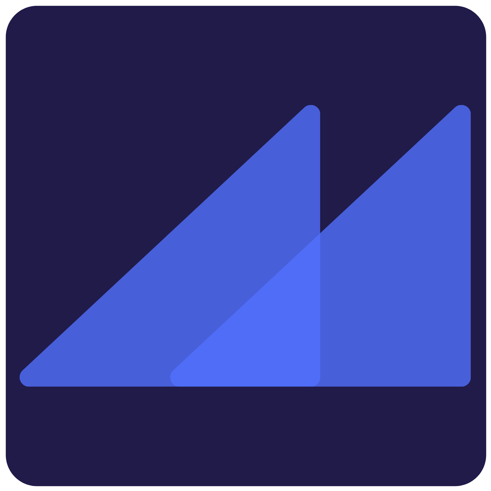

<p align="center">
  <a href="https://alpescap-canary.victorgomez.dev">
    
  </a>
</p>
<br/><br/>
  <h2 align="center">Alpes Capital's Landing Page</h2>
<br/><br/>

## Intro
Hello we are Alpes Capital and this is our landing page's front-end. We always try to keep it to the edge with new technologies and more versatile for the team, so they are able to modify it, without the webpage having performance issues.

The contents of this page are mostly static and use static rendering. Some elements are updated by NextJS in a defined time span (normally every week or month). Does not contain the blog, which is in a different repository. 

React streaming is not on!

## Running the project
#### *Before all:* Requires NodeJS version >= 12.22.0

#### *Downloading:*
Download/clone this repo in whichever method you prefer. Access the folders root...

#### *Before running:*
> In both cases you must create a env.development file by creating a ``` .env.development ``` file containing
```environment
  NEXT_PUBLIC_SITE_URL='http://localhost:3000'
  GA_TRACKING_ID={your_goggle_analytics_tracking_id}
  MONGODB_URI={your_mongo_db_uri}
  SUPABASE_ENDPOINT={your_supabase_endpoint}
  SUPABASE_API_KEY={your_supabase_api_key}
  ANALYZE={is_optional--if_equals_true_creates_bundle_analysis_under_.next_folder}
```

#### *Installing deps.:*
```bash
yarn 
```
> or you may use npm if you will by running ```npm i```

#### *Running:*
Well, there are two ways to run the project, in ```production ``` mode or ```development ``` mode

- Development
  
  ...just run
  ```bash
   yarn dev
  ```

- Production

  ...build time
  ```bash
   yarn build:test
  ```

  ...runtime
   ```bash
   yarn start
  ```

>In both cases, in the end, a local server will be opened on port ```3000``` ... so access in your browser [```http:///localhost:3000/```](http://localhost:3000/) and you should be able to see the webpage :D

## Main stack and references

- Preact: javascript framework to create UI - version 10.6.4
- NextJS: React based web framework - version: 12.1.1-canary.1
- styled-components: CSS-in-JS framework for react - version: 5.3.3
- Typescript: strong typing javascript based language - version: 4.4.4
- jsonwebtoken: JWT decoding, signing and validation library - version: 8.5.1
- supabase-js: Supbase javascript client library - version: 1.29.2
- react-spring: Spring based physics animation library - version: 9.3.0
- axios: NodeJs HTTP client - version 0.24.0
- hookstate: React state management framework - version: 3.0.13
- zdog: svg animation library - version 1.1.2

> other secondary dependencies and dev dependencies can be seen in the [```package.json```](https://github.com/Alpes-Capital/landing-page-v2-prod/blob/main/package.json) file


## Contributors to this project
- [@Vicg853]( https://github.com/Vicg853 )


